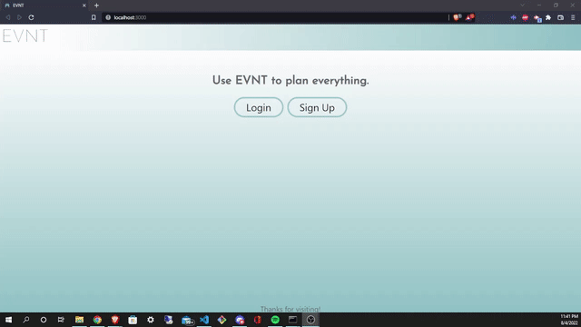

# EVNT

## Table of Contents
* [Description](#Description)
* [Installation](#Installation)
* [Usage](#Usage)
* [Questions](#Questions)
* [Credits](#Credits)

## Description
EVNT is a MERN Stack event planning application for hosts to utilize. Users send out a survey to guests to gather data on their availability, budget, role in the event (bridesmaid, etc.) and more. Simply create an account or login, create an event, create password if you want the survey to be password protected, and send out the survey to attendees. The guests' information is stored into the database and their availability is displayed on a calendar. On the homepage users can see the schedule for their events as well as the availability for the guests of all events and filter results by event (select all that apply). On a single event page, event planners have the option to filter the calendar results by choosing which guests they want to see the availability of. Click through the Nav bar to toggle between the calendar, guest data, your passwords for the event survey, and the survey link to send to guests. This SPA was built using GraphQL, MongoDB, Mongoose, Node.js, Express, Apollo, JWT, React, fullcalendar, CSS, and UIKit. 

## Usage
Here is a demonstration of how to use this app as an event planner:

        

Then you will send out the survey URL and guests will fill out the form like so:

        

## Installation
No installation is required to use this application. Simply access via the deployed Heroku URL: https://evnt-manager.herokuapp.com/

## Questions
If you have any questions about this project, please contact us via GitHub:
* https://github.com/garretthilberling
* https://github.com/jaredpennington

## Credits
This project was a collaborative project created by:
* Garrett Hilberling: https://www.linkedin.com/in/garretthilberling/
* Jared Pennington: https://www.linkedin.com/in/jpennington000/
